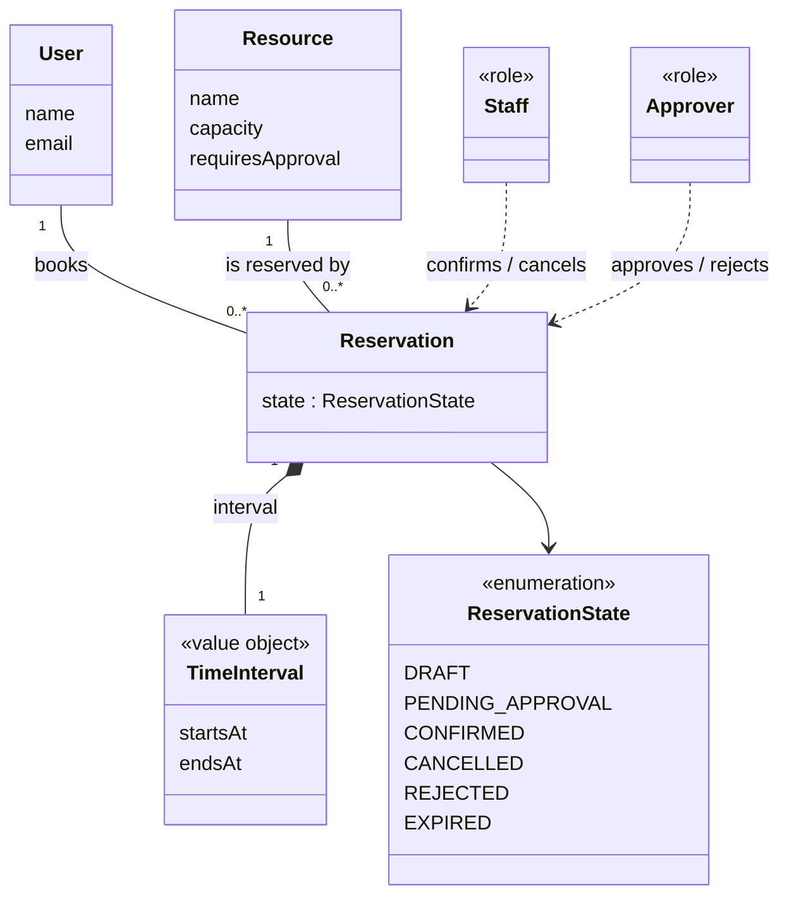

# Architecture & Decisions

## Tech stack

| Vrstva | Volba | Zdůvodnění |
|---|---|---|
| Jazyk | TypeScript (Node.js 20+) | Tým se rozhodl proti C#/Javě; TS dává statické typy a je pro tým nejznámější. |
| HTTP framework | Express | Nejrozšířenější, minimum boilerplate pro malé REST API. |
| Validace vstupu | Zod | Deklarativní validace + inference TS typů ze schémat. |
| ORM / DB přístup | Prisma | Typový bezpečný přístup k DB, snadné migrace, jeden zdroj pravdy (schema.prisma) pro model domény. |
| Databáze (cíl) | PostgreSQL | Zvoleno jako produkční cíl (podporovaný stack ze zadání), reálná relační DB s constraints. |
| Databáze (aktuální dev/spike) | SQLite | Viz ADR níže — v aktuálním vývojovém prostředí není dostupný Docker/PostgreSQL. |
| Testy | Vitest | Rychlé, nativní ESM/TS podpora, bez extra transpilační konfigurace. |

## ADR: SQLite pro C01 spike, PostgreSQL jako produkční cíl

**Kontext:** Zvolený tech stack (viz výše) počítá s PostgreSQL. Ve vývojovém prostředí, kde byl
prováděn C01 engineering spike, ale nebyl dostupný Docker ani lokální instalace PostgreSQL
(a nebylo možné je bez interakce nainstalovat).

**Rozhodnutí:** Spike A (persistence) byl proveden proti **SQLite** přes Prisma. `docker-compose.yml`
s PostgreSQL je připraven v repu pro každého, kdo má lokálně Docker.

**Důsledky:**
- Prisma schéma (`prisma/schema.prisma`) používá `datasource provider = "sqlite"`. Přechod na
  Postgres = změna `provider` na `"postgresql"`, nastavení `DATABASE_URL` na connection string
  z `docker-compose.yml` a spuštění `prisma migrate dev` znovu (Prisma migrace pro SQLite a
  Postgres nejsou binárně kompatibilní, musí se vygenerovat nové).
- Doménová pravidla se změnou providera nemění. Garance souběhu v repository je ale
  závislá na izolačním chování databáze; od dokončení C02 nestačí pouze přepnout provider.
- Tým by měl přechod na Postgres provést nejpozději před CP1 walking skeleton (C03/C04), protože
  SQLite nemá stejné chování při souběžném zápisu (relevantní pro future pressure Q níže).

## Future pressure: Q — Quality / Scale

Zvolená konkrétní pressure a zdůvodnění jsou zapsané v `docs/intent-and-change.md`
(sekce *Selected future pressure*) — shrnutí: 10× víc souběžných rezervací (páteční večer / velká
sportovní akce) zvyšuje riziko race condition v overlap-check při `confirm`. V C01 tuto pressure
**neimplementujeme**, jen ji evidujeme jako známé riziko pro pozdější iterace (kandidát na řešení:
DB transakce s `SELECT ... FOR UPDATE` / unique constraint na (resource, confirmed, no-overlap),
což u SQLite navíc není 1:1 přenositelné — další důvod pro včasný přechod na Postgres).

## ADR: atomické přechody v SQLite pro REQ-04 (22. 9. 2026)

**Problém:** samostatné čtení overlapu a následný bezpodmínečný zápis dovolovaly dvěma
Confirm/Approve alokovat stejný slot; staré čtení také mohlo přepsat Cancel/Reject.

**Rozhodnutí:** všechny rezervace mění stav přes `ReservationRepository.transition`.
Jeden podmíněný `updateMany` kontroluje ID a očekávaný stav; pro cílový CONFIRMED
navíc v témže UPDATE vyžaduje, aby neexistovala překrývající se CONFIRMED rezervace
stejného stolu. SQLite serializuje zápisy, takže následný zapisovatel vyhodnotí
predicate proti již zapsanému výsledku. Předchozí service overlap-check zůstává pro
konkrétní chybovou zprávu; bezpečnost nezávisí na jeho zastaralém výsledku.

Nulový počet změněných řádků je `ReservationConflictError` → HTTP 409. Dva Cancely
na výsledný CANCELLED vrátí stejný úspěch. Vrací se výsledek vlastního přechodu,
nikoli dodatečně načtený stav, který mezitím mohl změnit další příkaz.

**Ověření:** `tests/services/concurrency.test.ts` používá dva nezávislé Prisma
klienty a bariéru po čtení; oba požadavky prokazatelně pracují se starým stavem
před závodem. Pokrývá Confirm/Confirm, Approve/Approve, duplicate Approve,
Confirm/Cancel, Approve/Cancel, Approve/Reject, dvojí Cancel, dotyk intervalů a
smíšený Confirm/Approve. HTTP ověření je V-04R.8. Aktuální výstup je v
[evidenci dokončení](c02-completion-evidence.md).

**Rozsah garance:** aplikační příkazy na současném SQLite schématu. Přímé administrátorské
zápisy do DB ji mohou obejít. Pro PostgreSQL pod READ COMMITTED nelze ze stejného
dotazu odvodit stejnou garanci; před migrací zavést a ověřit např. serializaci podle
Resource či exclusion constraint pro intervaly, plus ochranu přechodů stavu.
Jednoduchý UNIQUE na identických začátcích/koncích libovolný překryv intervalů neřeší.

**C03 driver:** zachovat REQ-04 při změně DB a 10× zatížení; druhý driver je fyzická
expirace bez dalšího Approve a případná notifikace. Tyto mechanismy nejsou součástí
této změny. Nezavádí se globální mutex omezený na jeden proces.

## C03 Part A — AS-IS: Confirm Reservation

Mapování současné realizace jednoho scénáře z baseline v0.2. Tvrzení jsou ověřená
v kódu (commit `b4f597c`, branch `c03`), testy a za běhu aplikace dne 5. 10. 2026.
Řádky kódu odkazují na tento stav.

### A1. Sledovaný scénář

| Položka | Hodnota |
|---|---|
| Scénář / operace | [OP-03 Confirm Reservation](specification.md#op-03--confirm-reservation-req-03-req-04) |
| Požadavky | REQ-03, REQ-04 |
| Pravidla / invarianty | BR-01, BR-02, BR-04, BR-05 |
| Baseline | v0.2 |

### A2. Hlavní průchod scénáře v kódu

Hlavní úspěšný průchod: existující DRAFT, před termínem BR-04, Resource bez schvalování
(`requiresApproval = false`), žádná překrývající se CONFIRMED rezervace → `DRAFT → CONFIRMED`, HTTP 200.

| Krok scénáře z C02 | Realizace v kódu | Doklad |
|---|---|---|
| přijmout požadavek na potvrzení | route `POST /reservations/:id/confirm` v `createApp()` volá `ReservationService.confirmReservation(id)` | `src/http/app.ts:156-165` |
| načíst Reservation (locate DRAFT) | `ReservationService.confirmReservation()` → `ReservationRepository.findById(id)`; neexistuje → `NotFoundError` | `src/services/reservationService.ts:64-65`, `src/repositories/reservationRepository.ts:38` |
| ověřit, že přechod je povolený | `confirmReservation()` vyžaduje stav `DRAFT`, jinak `InvalidStateError` | `src/services/reservationService.ts:69-71`; runtime: druhý Confirm téže rezervace → 409 `Reservation is in state CONFIRMED, expected DRAFT` |
| ověřit BR-04 (no-show cutoff) | `isExpiredDraft(reservation, now)` (hranice `startsAt − 30 min`) | `src/services/reservationService.ts:73`, `src/domain/rules.ts:35`; test `V-03.3` v `tests/spec/c02-completion.test.ts` |
| vyhodnotit BR-05 (approval routing) | `ReservationRepository.findResourceById()`; při `requiresApproval = false` pokračuje přímým Confirm | `src/services/reservationService.ts:82-85`; test `confirms directly to CONFIRMED when the resource does not require approval` v `tests/services/reservationService.test.ts` |
| vyhodnotit konflikt (BR-02) | `ReservationRepository.findForResource()` + `findOverlappingConfirmed()` (vlastní rezervace vyřazena); konflikt → `OverlapError` | `src/services/reservationService.ts:87-92`, `src/domain/rules.ts:24` |
| změnit stav a uložit výsledek | `ReservationRepository.transition(reservation, CONFIRMED)` — **jeden** podmíněný `updateMany`: shoda ID + původního stavu a v témže dotazu podmínka, že neexistuje překrývající se CONFIRMED stejného Resource | `src/services/reservationService.ts:94`, `src/repositories/reservationRepository.ts:48-75` |
| vrátit výsledek volajícímu | route vrátí 200 a tělo rezervace se stavem `CONFIRMED` (202 jen pro `PENDING_APPROVAL`) | `src/http/app.ts:160-163`; test `confirms a DRAFT reservation with no conflict` v `tests/http/app.test.ts`; runtime: `POST /reservations/{id}/confirm` → `"state":"CONFIRMED"` [HTTP 200] |

Poznámky k mapování:

- Změna stavu a uložení nejsou dva kroky: rozhodnutí služby se uplatní až podmíněným
  zápisem v repository. Když podmínka neplatí (souběžná změna nebo mezitím potvrzený
  překryv), `transition()` nezmění žádný řádek a vyhodí `ReservationConflictError`
  (`src/repositories/reservationRepository.ts:66-72`).
- Pořadí kontrol v kódu (stav → BR-04 → BR-05 → BR-02) odpovídá *Main scenario*
  OP-03 („locate DRAFT; check BR-04; inspect BR-05; … check BR-02 and persist CONFIRMED“).
- Chyby z kroků výše převádí na HTTP jediné místo, `errorMiddleware()` (`src/http/app.ts:282`).

Testy ověřující průchod, spuštěné 5. 10. 2026: `npx vitest run tests/http/app.test.ts
tests/services/reservationService.test.ts tests/services/concurrency.test.ts
tests/spec/c02-completion.test.ts tests/domain/rules.test.ts` → 5 souborů, 59/59 testů prošlo.

### A3. Alternativní / chybová větev

Zvolená větev: **překryv při přímém Confirm → odmítnutí** (BR-02). Je to jediná větev OP-03,
kde se rozhoduje o exkluzivní alokaci stolu, a v kódu má dvě místa detekce.

| Co říká v0.2 | Kde se podmínka zjistí | Kde se rozhodne výsledek | Co dostane volající |
|---|---|---|---|
| „overlap on direct Confirm → 409, retaining DRAFT“ (OP-03 *Alternatives*) | (1) sekvenčně: `findOverlappingConfirmed()` nad výsledkem `findForResource()` v `ReservationService.confirmReservation()` — `src/services/reservationService.ts:87-91`, `src/domain/rules.ts:24`; (2) při souběhu: podmínka `none` v `updateMany` v `ReservationRepository.transition()` — `src/repositories/reservationRepository.ts:52-64` | (1) `confirmReservation()` vyhodí `OverlapError` a k zápisu nedojde (`reservationService.ts:92`); (2) `transition()` při `count === 0` vyhodí `ReservationConflictError` (`reservationRepository.ts:66-72`) | HTTP 409 z `errorMiddleware()` (`src/http/app.ts:283`, `:285`); rezervace zůstává DRAFT. (1) tělo `{"error":"Reservation overlaps with confirmed reservation <id>"}`; (2) tělo `{"error":"Reservation <id> changed concurrently or its slot is no longer available; reload and retry"}` |

Doklad:

- test `rejects confirm when a CONFIRMED reservation already overlaps the same resource`
  (`tests/http/app.test.ts`) — 409 a stav DRAFT v DB; `tests/services/reservationService.test.ts:107` — `OverlapError`;
- test `V-04R.1` (`tests/services/concurrency.test.ts`) — dva nezávislé Prisma klienty po zastaralém čtení,
  právě jeden vítěz, poražený dostane `ReservationConflictError`, druhá rezervace zůstane DRAFT;
  `V-04R.8` (`tests/spec/c02-completion.test.ts`) — totéž přes HTTP: 200/409, jedna CONFIRMED;
- runtime 5. 10. 2026: Confirm A (18–20 h) → 200; Confirm B (19–21 h, stejný stůl) →
  `{"error":"Reservation overlaps with confirmed reservation 391199ae-…"}` [HTTP 409]; B v DB = `DRAFT`.

Rozdíl v0.2 ↔ implementace:

| Specifikace | Implementace | Doklad |
|---|---|---|
| Overlap → 409, DRAFT zůstává; souběžný poražený → 409 bez přepsání vítěze | Odpovídá. **Rozdíl ve stavovém kódu ani ve výsledném stavu nenalezen.** | testy a runtime výše |
| Tělo odpovědi 409 v0.2 nedefinuje | Dvě různé výjimky a zprávy pro tutéž business situaci podle toho, zda konflikt zachytí služba, nebo až podmíněný zápis. Volající je podle status kódu nerozliší, jen podle textu. Nález, ne porušení v0.2. | `reservationService.ts:11-15`, `reservationRepository.ts:4-8`, `app.ts:283-285` |

Ověřené a zamítnuté kandidáty na rozdíl:

- *Chybějící Resource při Confirm* (`resource?.requiresApproval` je `undefined` → přímý Confirm,
  `reservationService.ts:82-83`): přes aplikaci nenastane. Reservation má povinnou FK na Resource
  (`prisma/schema.prisma`, model `Reservation`), neznámý `resourceId` při Create vrací 400
  (`app.ts:300-301`, P2003) a API nemá žádnou DELETE route (`src/http/app.ts`). Nejde o rozdíl proti v0.2.
- *BR-04: CANCELLED se uloží před vrácením 410* (`reservationService.ts:73-76`): v0.2 to výslovně
  požaduje („persists CANCELLED and returns 410“, BR-04); test `V-03.3`.
- *Pořadí kontrol*: odpovídá *Main scenario* (viz A2).

### A4. Hlavní části implementace

Aplikace je malá, proto jsou bloky na úrovni konkrétních tříd/modulů (jeden soubor = jeden blok).

| Část implementace | Typ / obsah | Role v tomto scénáři | Doklad |
|---|---|---|---|
| Reservation API | modul `src/http/app.ts`: route `POST /reservations/:id/confirm`, `errorMiddleware()` | přijme příkaz Confirm, zvolí 200/202, převede doménové a DB chyby na 404/409/410 | `src/http/app.ts:156-165`, `:282-305` |
| Reservation logic | třída `ReservationService` (`confirmReservation()`) | řídí scénář: načte rezervaci, ověří stav, BR-04, BR-05 a BR-02, požádá o přechod | `src/services/reservationService.ts:63-95` |
| Domain rules | modul `src/domain/rules.ts`: `isExpiredDraft()`, `findOverlappingConfirmed()`, `rangesOverlap()` | čisté funkce vyhodnocující BR-04 a BR-02/BR-01 nad načtenými daty | `src/domain/rules.ts:19-43` |
| Reservation persistence | třída `ReservationRepository` (+ `ReservationConflictError`), používá Prisma Client | načte Reservation a Resource, provede atomický podmíněný přechod stavu, při neúspěchu hlásí konflikt | `src/repositories/reservationRepository.ts:38-80` |

Sestavení: `src/index.ts` vytvoří `PrismaClient` a předá ho `createApp()`, která vytvoří
`ReservationRepository(prisma)` a `ReservationService(repository)` (`src/http/app.ts:84-86`).

### A5. Stav, změna stavu a pravidlo

#### Stav

| Otázka | Odpověď | Doklad |
|---|---|---|
| Kde je stav Reservation trvale uložen? | Tabulka `Reservation` v SQLite, sloupec `state` typu `String` (výchozí `"DRAFT"`). Hodnoty omezuje jen aplikace (`ReservationState` v `src/domain/types.ts`), DB je nekontroluje. Pro BR-05 se čte i `Resource.requiresApproval`. | `prisma/schema.prisma` (modely `Reservation`, `Resource`; `datasource db { provider = "sqlite" }`), `.env.example` (`DATABASE_URL="file:./dev.db"`) |
| Který kód rozhoduje o přechodu DRAFT → CONFIRMED? | `ReservationService.confirmReservation()` — po kontrole stavu, BR-04, BR-05 a BR-02 zvolí cílový stav CONFIRMED. | `src/services/reservationService.ts:63-94` |
| Který kód přechod provádí? | `ReservationRepository.transition()` — jediný podmíněný `updateMany` (`WHERE id AND state = původní stav AND [pro CONFIRMED] žádný překryv`). Rozhodnutí služby se uplatní, jen pokud podmínky platí i v okamžiku zápisu; jinak `ReservationConflictError`. Všechny přechody stavu Reservation jdou touto metodou. | `src/repositories/reservationRepository.ts:48-75`; ADR *atomické přechody v SQLite pro REQ-04* výše; testy `V-04R.1`–`V-04R.7` |

#### Business pravidlo BR-02 — Exclusive Resource

*„No committed application state may contain two overlapping CONFIRMED reservations of the
same Resource.“* (BR-02, interval podle BR-01)

| Otázka | Odpověď | Doklad |
|---|---|---|
| Kde se zjistí podmínka pravidla? | **Dvě místa.** (1) `findOverlappingConfirmed()` + `rangesOverlap()` nad seznamem z `findForResource()` (v paměti, nad již načtenými daty); (2) predikát `resource.reservations.none { state = CONFIRMED, startsAt < endsAt, endsAt > startsAt, id ≠ vlastní }` uvnitř `updateMany` (v DB, v okamžiku zápisu). | (1) `src/services/reservationService.ts:87-91`, `src/domain/rules.ts:19-31`; (2) `src/repositories/reservationRepository.ts:55-62` |
| Kde se podle výsledku rozhodne? | (1) `confirmReservation()` → `OverlapError`, zápis se vůbec nezkusí; (2) `transition()` → `count === 0` → `ReservationConflictError`. Stejné rozhodnutí dělá i `approveReservation()` (OP-05) — znovu (1) i (2). | (1) `reservationService.ts:92`; (2) `reservationRepository.ts:66-72`; OP-05: `reservationService.ts:111-118` |
| Kde se provede výsledná změna stavu? | Pouze v `ReservationRepository.transition()` (`updateMany … data: { state }`). Při porušení BR-02 se nezmění nic a rezervace zůstane DRAFT. | `reservationRepository.ts:52-65`; test `rejects confirm when a CONFIRMED reservation already overlaps…`, runtime v A3 |

Skutečná pojistka BR-02 je místo (2). Místo (1) dává jen srozumitelnější chybu v sekvenčním
případě — při souběhu je jeho výsledek zastaralý (prokazuje `V-04R.1`, kde obě služby místo (1)
projdou a rozhodne až (2)). Garance (2) stojí na tom, že SQLite serializuje zapisovatele
(komentář v `reservationRepository.ts:49-51`, ADR výše).

### A6. Relevantní závislosti

| Závislost | Kde se napojuje na váš kód | Která část zná její technické API | Doklad |
|---|---|---|---|
| Databáze SQLite (přes Prisma Client) | `src/index.ts` vytvoří `new PrismaClient()` a předá ho `createApp(prisma)`; ta jím vytvoří `ReservationRepository` | Pro Confirm jen `ReservationRepository` (`findUnique`, `findMany`, `updateMany`, filtr `none`). `ReservationService` ani `rules.ts` Prismu neimportují. `app.ts` zná Prismu kvůli sestavení a mapování `PrismaClientKnownRequestError` P2003 (v Confirm se neuplatní). | `src/index.ts`, `src/http/app.ts:84-86`, `:300`, `src/repositories/reservationRepository.ts:1`, `:38-80`; `prisma/schema.prisma` |
| Notification Service | **V současné implementaci není.** Confirm nikoho neupozorňuje. | — | `grep` přes `src/` nenajde HTTP klienta (`fetch`, `axios`, `http.request`) ani mailer; v0.2 notifikace vylučuje (R-15) |
| IdP / autentizace | **V současné implementaci není.** Confirm nese jen ID rezervace, identitu ani role nekontroluje. | — | `src/http/app.ts:156-165` (žádný auth middleware), v0.2 R-7 |

Express, Zod a Vitest nejsou uvedeny (běžné knihovny frameworku). Pro A7 platí: mimo
Application code je jediná závislost databáze.

### A7. AS-IS strukturální diagram

```text
+----------------------------- Application code ------------------------------+
|                                                                             |
|  [Reservation API]  (module, src/http/app.ts)                               |
|  role: accepts POST /reservations/:id/confirm, maps errors to HTTP          |
|        |                                                                    |
|        | confirmReservation(id)                                             |
|        v                                                                    |
|  [Reservation logic]  (class ReservationService)                            |
|  role: orchestrates Confirm: state, BR-04, BR-05, BR-02, requests change    |
|        |                                  |                                 |
|        | isExpiredDraft(),                | findById, findResourceById,     |
|        | findOverlappingConfirmed()       | findForResource,                |
|        v                                  | transition(CONFIRMED)           |
|  [Domain rules]  (module rules.ts)        v                                 |
|  role: evaluates BR-04, BR-02/BR-01   [Reservation persistence]             |
|                                       (class ReservationRepository)         |
|                                       role: loads Reservation/Resource,     |
|                                       atomic conditional state update       |
|                                                  |                          |
+--------------------------------------------------|--------------------------+
                                                   | read Reservation/Resource,
                                                   | conditional UPDATE state
                                                   | (Prisma Client)
                                                   v
                                     [Reservation DB]  (database, SQLite)
                                     tables Reservation, Resource
```

Šipky odpovídají směru volání (a importů): API → logic → rules / persistence → DB.
Domain rules nevolají nic dalšího. V tomto scénáři se nevolá žádný externí systém
(notifikace, IdP); kód žádného HTTP klienta ani autentizaci neobsahuje — podrobnosti v A6.

Obsah bloků:

- **Reservation API:** `createApp()` — route `POST /reservations/:id/confirm`, `errorMiddleware()`
- **Reservation logic:** `ReservationService.confirmReservation()`; výjimky `NotFoundError`,
  `InvalidStateError`, `NoShowExpiredError`, `OverlapError`
- **Domain rules:** `isExpiredDraft()`, `findOverlappingConfirmed()`, `rangesOverlap()`
- **Reservation persistence:** `ReservationRepository.findById()`, `findResourceById()`,
  `findForResource()`, `transition()`; `ReservationConflictError`
- **Reservation DB:** SQLite (`prisma/schema.prisma`, `datasource db { provider = "sqlite" }`),
  modely `Reservation` (sloupec `state`) a `Resource` (sloupec `requiresApproval`)

### A8. Otázka pro další C03

| Položka | Obsah |
|---|---|
| Otázka | Jak zajistit BR-02 / REQ-04 (nejvýše jedna CONFIRMED na překrývající se interval stolu) po přechodu na PostgreSQL a při 10× zátěži, když dnešní garance stojí na serializaci zápisů v SQLite? |
| Doklad | Exkluzivitu skutečně vynucuje jen predikát `none { … }` uvnitř jediného `updateMany` v `ReservationRepository.transition()` (A5, místo 2); kontrola ve službě je při souběhu zastaralá (`V-04R.1`). Kód sám uvádí: *„SQLite serializes writers … Reassess isolation/constraints before moving this implementation to Postgres“* (`src/repositories/reservationRepository.ts:49-51`). DB schéma žádné omezení proti překryvu nemá (`prisma/schema.prisma`, `state` je `String`). Produkční cíl je PostgreSQL (ADR *SQLite pro C01 spike…*). |
| Proč je důležitá | BR-02 je hlavní invariant domény a REQ-04 je požadavek v0.2. Pod READ COMMITTED v PostgreSQL mohou dva souběžné `UPDATE … WHERE NOT EXISTS` oba projít, takže by vznikly dvě CONFIRMED na stejný stůl a čas, aniž by to aplikace poznala. Rozhodnutí (serializace podle Resource, exclusion constraint, úroveň izolace) mění strukturu persistence a je to přímo C03 driver *Quality / Scale*. |

## C03 — Architecture

Navazuje na [Část A](#c03-part-a--as-is-confirm-reservation). Scénář zůstává
OP-03 Confirm Reservation (s větví BR-05 do OP-05 Approve), baseline v0.2.

### B. Architektonické drivery

| Driver | Podklad / zdroj | Proč ovlivňuje architekturu | Otázka, kterou musí architektura vyřešit |
|---|---|---|---|
| **D1 — Exkluzivní alokace při souběhu** | BR-02, REQ-04; Část A — A5 (BR-02 ve dvou místech), A8; test `V-04R.1` | Dva souběžné Confirm/Approve mohou oba vidět „bez konfliktu“. Kontrola ve službě je při souběhu zastaralá; invariant dnes drží jen podmínka uvnitř jednoho `UPDATE`. | Kde a čím se musí udělat autoritativní rozhodnutí o alokaci, aby BR-02 zůstalo pravdivé i při souběhu? |
| **D2 — Přechod na PostgreSQL a 10× zátěž** | ADR *SQLite pro C01 spike, PostgreSQL jako produkční cíl*; future pressure Q (`intent-and-change.md`: 10× souběžných rezervací v páteční večer); C02 driver 1 (`specification.md`) | Současná garance stojí na tom, že SQLite serializuje zapisovatele (`reservationRepository.ts:49-51`). Pod READ COMMITTED ji stejný dotaz nedá. Při 10× zátěži navíc roste počet souběhů na stejném stole. | Které garance musí poskytnout databáze a které aplikace, aby D1 platil i na produkčním provideru a pod zátěží — a jak se to ověří? |
| **D3 — Approval přichází později** | BR-05, BR-06, OP-05, R-16; C02 driver 2 | PENDING_APPROVAL přežívá request. Vypršení se detekuje jen při dalším Approve (R-16) — bez něj zůstane rezervace PENDING i po termínu. Approve musí BR-02 vyhodnotit znovu, proti stavu v okamžiku rozhodnutí. | Kdo vlastní pending stav a kdo provede pozdější přechod (approve / reject / expire)? Stačí lazy detekce, nebo je potřeba aktivní mechanismus? |
| **D4 — Jeden vlastník lifecycle přechodů** | Statechart C02 (`diagrams/state-diagram.md`); Část A — A3, A5 (BR-02 rozhoduje služba i repository, dvě různé výjimky; Confirm a Approve duplikují stejnou logiku) | Když stejné rozhodnutí dělá víc míst, mohou se rozejít a volající dostane jiný výsledek podle toho, kde konflikt zachytí. Každá změna pravidla se musí udělat na více místech. | Který prvek je jediným vlastníkem rozhodnutí o lifecycle přechodu a které části jej smí pouze vyžádat? |

Vědomě **není** driverem Notification Service: v0.2 notifikace vylučuje (R-15) a v kódu žádná
integrace není (Část A, A6). Je uvedena jako podmínka znovuotevření v ADR.

### C1. Doménový model (slice Confirm / Approve)

Dosud explicitní doménový model neexistoval (C01 měl jen seznam pojmů v `intent-and-change.md`).
Model obsahuje pouze pojmy potřebné pro zvolený scénář a drivery.



| Pojem | Význam v tomto slice | Zdroj |
|---|---|---|
| Reservation | Záměr (DRAFT) nebo alokace (CONFIRMED) jednoho stolu na interval; nese lifecycle stav. | OP-01…05, statechart |
| Resource | Stůl; celý stůl patří jedné rezervaci (R-9). `requiresApproval` určuje cestu Confirm (BR-05). | BR-02, BR-05, R-9 |
| User | Host, pro kterého rezervace vzniká. | OP-01 |
| TimeInterval | Polouzavřený interval `[startsAt, endsAt)`; překryv dle BR-01. Odvozené hranice: cutoff BR-04/BR-06 = `startsAt − 30 min`. | BR-01, BR-04, BR-06 |
| ReservationState | Stavy a povolené přechody dle statechartu v0.2. | `diagrams/state-diagram.md` |
| Staff, Approver | Role aktérů. Nejsou uložené ani ověřované (R-7) — model je uvádí jen jako původce příkazů. | use-case, R-7 |

Invarianty patřící ke vztahům:

- **BR-02 na vztahu Resource 1 — 0..\* Reservation:** mezi rezervacemi jednoho Resource ve stavu
  CONFIRMED se žádné dva `TimeInterval` nepřekrývají. Ostatní stavy kapacitu neblokují (R-1).
- **BR-01 na TimeInterval:** `startsAt < endsAt`; sousední intervaly se nepřekrývají.

Approval nemá vlastní entitu: v0.2 jej modeluje jako stav `PENDING_APPROVAL` téže Reservation
(žádná historie rozhodnutí, žádný approver se neukládá). Order/MenuItem (OP-06) do slice nepatří.

### C2. Odpovědnosti systému

| # | Zdroj | Odpovědnost | Co musí rozhodovat / vlastnit | Jeden jasný vlastník? | Důvod |
|---|---|---|---|---|---|
| R1 | OP-03 trigger, *Common HTTP outcomes* | Přijmout příkaz Confirm/Approve a přeložit výsledek na odpověď (200/202/404/409/410) | protokolový kontrakt, mapování výsledků | ano | stejný business výsledek musí mít vždy stejnou odpověď (Část A: dnes dvě zprávy pro tentýž konflikt) |
| R2 | Statechart, OP-03, BR-04, BR-05 | Rozhodnout, zda je přechod povolený, a zvolit cílový stav (CONFIRMED / PENDING_APPROVAL / CANCELLED) | lifecycle přechod Reservation | ano | různé části nesmí rozhodnout odlišně (D4) |
| R3 | BR-02, REQ-04 | Vyhodnotit konflikt a zachovat invariant exkluzivity | rozhodnutí o alokaci při konfliktu | ano | souběh nesmí invariant porušit (D1); dnes rozhodují dvě místa |
| R4 | REQ-04 („cannot overwrite a decision based on newer state“) | Trvale uložit přechod jen tehdy, platí-li očekávaný stav i podmínky v okamžiku zápisu | atomický commit přechodu | ano | zastaralé čtení nesmí přepsat novější rozhodnutí (D1, D2) |
| R5 | OP-05, BR-05, BR-06, R-16 | Spravovat čekající žádost: approve / reject / expire | PENDING_APPROVAL stav a jeho ukončení | ano | stav přežívá request (D3) |
| R6 | BR-04, BR-06, R-6 | Vyhodnotit časové hranice (cutoff) proti jednotnému zdroji času | definice lhůt a „now“ | ano | Confirm i Approve musí počítat lhůtu stejně |
| R7 | OP-02, BR-02 | Odpovědět na dostupnost stolu | čtení, žádná změna stavu | ne (čtení) | musí ale používat **stejnou definici** překryvu jako R3 |
| R8 | D2, ADR SQLite → PostgreSQL | Poskytnout DB-specifickou garanci souběhu (izolace, zámek, constraint) | technický mechanismus | podle návrhu | závisí na zvolené technologii; je předmětem rozhodnutí D |

Seskupení a oddělení:

| # | Musí být seskupena s | Má být oddělena od | Proč |
|---|---|---|---|
| R1 | — | R2–R8 | jiný důvod změny (protokol, HTTP) a vstupní boundary |
| R2 | R5, R6 | R1, R8 | sdílí lifecycle stav Reservation a statechart |
| R3 | R4 (atomicita), R7 (definice BR-02) | R1 | rozhodnutí o konfliktu a zápis musí být nedělitelné; R7 musí počítat stejně |
| R4 | R3 | R2 (pravidla), R1 | atomický zápis patří k invariantu, ne k HTTP; technologie je jiný důvod změny než pravidla |
| R5 | R2, R3 | R1 | approve je lifecycle přechod a musí znovu vyhodnotit BR-02 |
| R6 | R2, R5 | R8 | čisté pravidlo; nezávisí na DB |
| R7 | R3 (definice) | R4 | jen čte, nemění stav |
| R8 | R4 | R2, R3, R5, R6 | technologie DB se mění (D2) nezávisle na business pravidlech |

Napětí, které řeší krok D: R3 a R4 musí být nedělitelné (jinak D1 neplatí), ale R8 — technologie,
která tu nedělitelnost poskytuje — se má měnit odděleně od pravidel (D2). Kde tedy autoritativní
rozhodnutí o alokaci leží?
