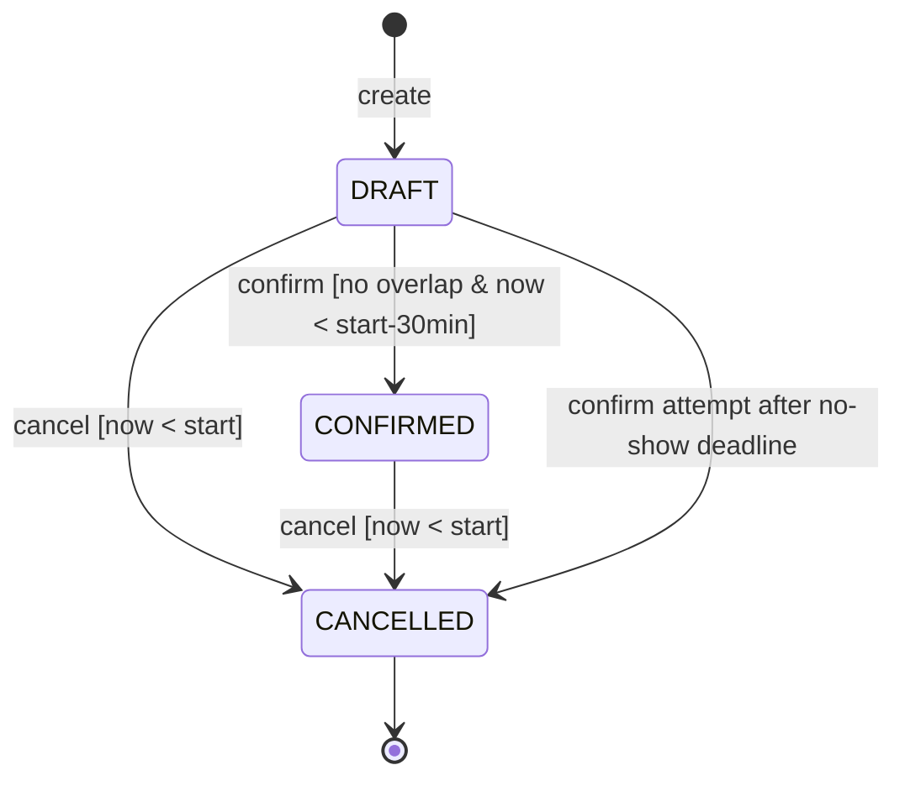
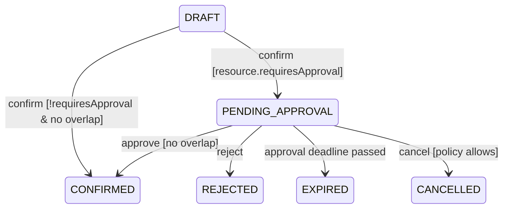

# C02 — plán práce pro 2 lidi

> Původní plán a rozdělení odpovědností. Stav po provedení auditu 22. 9. 2026 je v
> [evidenci dokončení](c02-completion-evidence.md#aktualizovaný-stav-issue-9).
> Níže uvedené návrhy a historické počty testů nepřepisují aktuální specifikaci.
> Technické review provedl Codex; požadované křížové lidské review a týmové
> schválení musí být doloženy skutečnými členy týmu.

Rozdělení práce na C02 (*Úplná specifikace základního chování → aplikace vytvořená s pomocí AI → změna*).
Deadline: **před C03**. Vstup: dokončené C01 (Project Frame, doména, repo, spike, walking skeleton) —
nic z toho se znovu nevytváří.

| | Osoba A | Osoba B |
|---|---|---|
| Jméno | **Michal Křižák** | **Jaroslav Petera** |
| Těžiště | **Vstup do systému**: Create + Check Availability, use-case pohled, evidence | **Životní cyklus rezervace**: Confirm + Cancel + Approve, stavový diagram, změna v0.2 |

Princip rozdělení: A vlastní *„co do systému vstupuje a co systém odpovídá"*, B vlastní
*„jak rezervace mění stavy"*. Hranice mezi nimi (kdy DRAFT přestává být jen záměrem a začíná
blokovat Resource) je jediné skutečně sdílené místo — proto je na ni v plánu samostatný sync bod.

**Každý kus práce reviewuje ten druhý.** Review není formalita: kontrola přijetí požadavku
(sekce 3 zadání) je přesně to, co reviewer dělá — a co po vás může kdokoliv chtít obhájit.

---

## 0. Kdo dělá co — souhrn

Kompletní seznam úkolů každého člověka v pořadí, v jakém se dělají. Detaily a kritéria hotového
jsou v příslušných fázích níže.

### Osoba A — vstup do systému

| # | Fáze | Úkol | Výstup |
|---|---|---|---|
| A0 | 0 | Spolurozhodnout R-1…R-10 a **zapsat je** jako sekci *Accepted decisions* | `docs/specification.md` |
| A1 | 1 | **OP-01 Create Reservation** (REQ-01) — celá šablona | `docs/specification.md` |
| A2 | 1 | **OP-02 Check Availability** (REQ-02) — celá šablona | `docs/specification.md` |
| A3 | 1 | **BR-01** Interval semantics + **BR-02** Exclusive Resource invariant | `docs/specification.md` |
| A4 | 1 | **Review OP-03, OP-04, BR-03, BR-04 od B** — 9 otázek kontroly přijetí | komentáře v PR |
| A5 | 2 | **Use case diagram** (9a) — hranice systému, aktéři, 4 cíle | `docs/diagrams/` |
| A6 | 2 | **Activity diagramy** pro Create a Check Availability (9c) | `docs/diagrams/` |
| A7 | 3 | Konzistenční kontroly **K-1, K-2, K-4, K-7** | zápis v `specification.md` |
| A8 | 4 | Ověřit v aplikaci chování Create a Availability, doplnit testy | `src/`, `tests/` |
| A9 | 4 | **Spustit 4 příklady**: Create úspěch + `start == end`; Availability volno + kolize a hranice | výstupy do evidence |
| A10 | 5 | Analýza dopadu změny: řádky **Create, Availability, Use case diagram, Ověření** | `specification.md` |
| A11 | 6 | Úprava **OP-02** o PENDING_APPROVAL + **seznam nedotčených částí se zdůvodněním** | `specification.md` |
| A12 | 6 | Aktualizace **use case diagramu na v0.2** (aktér Schvalovatel) + nové příklady ověření dostupnosti | `docs/diagrams/` |
| A13 | 7 | Implementace chování Availability dle v0.2 + aktualizace testovacího UI v `public/` | `src/`, `public/`, `tests/` |
| A14 | 8 | **Napsat evidenci C02** (všech 8 položek) | `docs/evidence-and-evolution.md` |
| A15 | 8 | **Review** OP-05 Approve, stavového diagramu v0.2 a architektonického driveru od B | komentáře v PR |
| A16 | mimo baseline | **OP-06 Place Order** — objednávka jídla a pití k probíhající rezervaci + účet hosta: specifikace, BR-05/BR-06, activity diagram, implementace, 19 testů | `specification.md`, `docs/diagrams/`, `src/`, `tests/` — **hotovo** |

### Osoba B — životní cyklus rezervace

| # | Fáze | Úkol | Výstup |
|---|---|---|---|
| B0 | 0 | Spolurozhodnout R-1…R-10 (hlavně R-4, R-5, R-8 — politika rušení a no-show) | podklad pro A0 |
| B1 | 1 | **OP-03 Confirm Reservation** (REQ-03 + REQ-04 souběh) — celá šablona | `docs/specification.md` |
| B2 | 1 | **OP-04 Cancel Reservation** (REQ-05) — celá šablona | `docs/specification.md` |
| B3 | 1 | **BR-03** Cancellation policy + **BR-04** No-show rule z C01 | `docs/specification.md` |
| B4 | 1 | Tabulka stavů a přechodů (textová předloha diagramu) | `docs/specification.md` |
| B5 | 1 | **Review OP-01, OP-02, BR-01, BR-02 od A** — 9 otázek kontroly přijetí | komentáře v PR |
| B6 | 2 | **Stavový diagram** celého životního cyklu (9b) včetně guardů | `docs/diagrams/` |
| B7 | 2 | **Activity diagramy** pro Confirm a Cancel (9c) — včetně větví no-show a overlap | `docs/diagrams/` |
| B8 | 3 | Konzistenční kontroly **K-3, K-5, K-6** | zápis v `specification.md` |
| B9 | 4 | **Doimplementovat časovou hranici rušení** (`now < start`) + ověřit idempotenci dle R-5 | `src/`, `tests/` |
| B10 | 4 | **Spustit 4 příklady**: Confirm úspěch + kolize; Cancel před začátkem + pokus po začátku | výstupy do evidence |
| B11 | 5 | Analýza dopadu změny: řádky **Confirm, Approve, Cancel, Stavový diagram, Architektura** | `specification.md` |
| B12 | 6 | **OP-05 Approve Reservation** — úplná specifikace včetně zamítnutí a vypršení | `specification.md` |
| B13 | 6 | Úprava **OP-03** (dělení na žádost + schválení) a **OP-04** (rušení PENDING_APPROVAL) | `specification.md` |
| B14 | 6 | Nová/upravená **BR** (`requiresApproval`, platnost schválení, význam EXPIRED) + **stavový diagram v0.2** | `specification.md`, `docs/diagrams/` |
| B15 | 7 | Prisma schéma + migrace pro nové stavy, endpointy `approve`/`reject`, **opakovaná kontrola overlapu při approve**, vypršení | `prisma/`, `src/`, `tests/` |
| B16 | 8 | Formulovat **architektonický driver pro C03** + **review evidence od A** | `evidence-and-evolution.md` |

### Společně (nedělitelné)

| Fáze | Co | Proč to nejde rozdělit |
|---|---|---|
| 0 | Rozhodnutí R-1…R-10 | Určují význam pojmů pro oba; kdyby je psal každý sám, vzniknou dvě různé specifikace |
| 3 | Kontrola konzistence a **schválení baseline v0.1** | Zadání vyžaduje explicitní týmové schválení |
| 5 | **Analýza dopadu změny před psaním** | Smysl cvičení je posoudit dopad dřív, než se cokoliv přepíše |
| 7/8 | Ověření, že aplikace odpovídá v0.2, tagy `v0.1` a `v0.2` | Podepisujete oba |

### Nejzatíženější místa

- **A má nejvíc práce ve fázi 6** (úprava OP-02 je nejtěžší rozhodnutí celé změny) — pokud B skončí dřív, pomůže s příklady ověření dostupnosti.
- **B má nejvíc práce ve fázi 7** (nové stavy, migrace, dva nové endpointy) — pokud to nestíhá, A přebírá `reject` endpoint a testy vypršení.

---

## 1. Pravidla spolupráce

| | |
|---|---|
| Branch | `c02-spec-v01` → `c02-app-v01` → `c02-spec-v02` → `c02-app-v02` (jedna větev na fázi) |
| Integrace | přes PR do `main`, **merge až po review druhého člena** |
| Nové soubory | `docs/specification.md` (baseline v0.1 → v0.2), `docs/diagrams/` (Mermaid), doplnění `docs/evidence-and-evolution.md` |
| Diagramy | Mermaid přímo v markdownu — GitHub je vykreslí, jsou verzovatelné a v diffu je vidět změna |
| Jazyk | specifikace anglicky (jako referenční příklady v zadání), komentáře a evidence česky |
| Tag | `v0.1` po fázi 4, `v0.2` po fázi 7 |

---

## 2. Fáze 0 — společná rozhodnutí (30–45 min, oba u toho)

**Tohle musí padnout dřív, než kdokoliv začne psát.** Jsou to přesně ta místa, kde by AI potichu
rozhodla za vás — a u kterých musíte umět říct *proč tak a ne jinak*.

| # | Otázka | Doporučení | Důsledek, když se rozhodne jinak |
|---|---|---|---|
| R-1 | Alokuje DRAFT Resource? | **Ne** — DRAFT je jen záměr, blokuje až CONFIRMED (shodné s referenčním příkladem i s naším kódem) | Kdyby DRAFT blokoval, musí se overlap kontrolovat už v Create a Availability musí DRAFT počítat |
| R-2 | Kontroluje se kolize už při Create? | **Ne**, plyne z R-1 | Jinak přepsat OP-01 i testy |
| R-3 | Sémantika intervalu | **`[start, end)`** — půlotevřený; sousední rezervace 10–11 a 11–12 nekolidují | Musí sedět v BR-01, v Availability, v Confirm i v testech (hraniční příklad `[11:00,12:00)`) |
| R-4 | Politika rušení (BR-03) | **Zrušit lze DRAFT i CONFIRMED, ale jen dokud `now < start`** | Pozor: **současný kód tohle nehlídá** — zrušit jde kdykoliv. Bude potřeba doimplementovat |
| R-5 | Zrušení už zrušené rezervace | **Idempotentní úspěch** (200, stav zůstává CANCELLED) — klient po timeoutu může poslat cancel dvakrát | Pokud zvolíte explicitní odmítnutí, musí to být v OP-04, v testu i v chování API |
| R-6 | Zdroj času | **Serverový čas v UTC**, v service vrstvě injektovatelný (`now: Date = new Date()`) | Bez injektovatelného času nejde otestovat no-show ani hranice rušení |
| R-7 | Autorizace | **TBD — explicitně mimo rozsah v0.1**: „authorized User" znamená, že požadavek nese `userId` existujícího uživatele; role se neřeší | Nesmí z toho vzniknout vymyšlená přesnost (role, tokeny), pokud to nikdo nezadal |
| R-8 | Naše doménové pravidlo z C01 (no-show) | **BR-04**: DRAFT nelze potvrdit méně než 30 min před `start`; pokus o potvrzení rezervaci překlopí do CANCELLED | Číslo 30 min je týmové rozhodnutí — v Rationale uvést, že jde o zvolenou hodnotu, ne o zjištěný fakt |
| R-9 | Exkluzivní vs. kapacitní Resource | **Exkluzivní** (jeden stůl = jedna rezervace v čase), i když má stůl `capacity` — kapacita je počet míst, ne počet souběžných rezervací | Kdyby byl kapacitní, BR-02 se nahrazuje pravidlem o kapacitě a musí se to zdůvodnit |
| R-10 | Souběh (REQ-04) | **Pozorovatelný výsledek**: ze dvou kolidujících souběžných potvrzení skončí v CONFIRMED nejvýše jedno. *Jak* se to zajistí, je téma C03 | Toto je zároveň náš architektonický driver z C01 (future pressure Q) |

> Výsledek zapište jako sekci *Accepted decisions* na začátek `docs/specification.md`.
> Rozhodnutí bez zdůvodnění se u obhajoby počítá jako nerozhodnuté.

---

## 3. Fáze 1 — baseline v0.1, textová specifikace

Soubor: `docs/specification.md`. Struktura každé operace přesně podle šablony ze zadání
(Cíl, Spouštěcí událost, Pozorovatelný požadavek, Předpoklady, Stav po provedení, Změna stavu,
Odkaz na pravidla, Hlavní scénář, Alternativní/chybové výsledky, Příklady ověření, Zdůvodnění,
Předpoklad/TBD — poslední položka **jen když je něco opravdu nerozhodnuté**).

### Osoba A

| Úkol | Výstup | Hotovo když |
|---|---|---|
| A1 | **OP-01 Create Reservation** — REQ-01 | je popsáno, že Create **nealokuje** Resource (R-1/R-2); chybové výsledky: neznámý Resource, neznámý User, `start >= end` |
| A2 | **OP-02 Check Availability** — REQ-02 | je jednoznačně uvedeno, **které stavy blokují** (jen CONFIRMED) a že dotaz nic nemění; hraniční příklady na dotyk intervalů |
| A3 | **BR-01 Interval semantics** + **BR-02 Exclusive Resource invariant** | definováno jednou, ostatní operace jen odkazují |
| A4 | Sekce *Accepted decisions* (zápis z fáze 0) | každé rozhodnutí má jednu větu zdůvodnění |

### Osoba B

| Úkol | Výstup | Hotovo když |
|---|---|---|
| B1 | **OP-03 Confirm Reservation** — REQ-03 + REQ-04 (souběh) | jsou uvedeny všechny důvody odmítnutí: nepovolený výchozí stav, overlap, no-show (BR-04); a že při odmítnutí **stav zůstává DRAFT** — kromě no-show, kde se dle BR-04 ruší, což musí být explicitní |
| B2 | **OP-04 Cancel Reservation** — REQ-05 | politika R-4 a R-5 je promítnutá do předpokladů, chybových výsledků i příkladů; je popsaný výsledek souběhu Cancel × Confirm |
| B3 | **BR-03 Cancellation policy** + **BR-04 No-show rule (z C01)** | BR-04 popisuje chování, ne implementaci (žádné odkazy na konkrétní funkce) |
| B4 | Přehledová tabulka stavů a přechodů (textová předloha pro diagram 9b) | tabulka odpovídá tomu, co je v OP-01…OP-04 |

### Křížová kontrola přijetí požadavků (oba, ~30 min)

Každý projde **cizí** operace a u každého požadavku odpoví na 9 otázek ze sekce 3 zadání:
význam, potřeba, pozorovatelný výsledek, proveditelnost, ověřitelnost, stav/čas, souběh,
konzistence, nejistota. Pozor hlavně na:

- **Pozorovatelný výsledek** — nesmí tam být „uloží se do PostgreSQL přes Prismu"; to je návrhové rozhodnutí, ne požadavek.
- **Nejistota** — cokoliv nevíte, patří do TBD, ne do vymyšleného čísla.

Nálezy se zapisují jako komentáře v PR — tím zároveň vzniká evidence, že review proběhla.

---

## 4. Fáze 2 — diagramy (`docs/diagrams/`)

| Kdo | Co | Na co si dát pozor |
|---|---|---|
| **A** | **9a Use case diagram** — hranice systému, aktéři (Host, Obsluha), všechny 4 cíle | Žádné databáze, třídy ani komponenty uvnitř. Notification Service kreslete, **jen pokud ji skutečně máme** — v v0.1 je to zatím jen definovaná hranice, takže ji buď vynechte, nebo označte jako plánovanou |
| **B** | **9b Stavový diagram Reservation** — celý životní cyklus | Přechody musí mít podmínky (guards) shodné s textem: `DRAFT --confirm [no overlap & not expired]--> CONFIRMED`, `DRAFT/CONFIRMED --cancel [now < start]--> CANCELLED` |
| **A** | **9c Activity diagram** pro Create a Check Availability | Ukázat rozhodovací body (validace intervalu, existence Resource, overlap) |
| **B** | **9c Activity diagram** pro Confirm a Cancel | Confirm musí ukázat i větev no-show a větev overlap |

Mermaid předloha pro stavový diagram v0.1:



---

## 5. Fáze 3 — kontrola konzistence (společná, ~30 min)

Projděte celou specifikaci **jako jeden systém tvrzení**, ne jako 4 izolované texty. Tabulka ze
sekce 10 zadání jako checklist — u každého řádku zapište „OK" nebo nalezený rozpor a jeho opravu:

| # | Kontrola | Kdo hlídá |
|---|---|---|
| K-1 | Create vs. Confirm — alokuje se Resource až při Confirm? | A |
| K-2 | Availability vs. Confirm — považují obě za blokující **stejné** stavy? | A |
| K-3 | Cancel vs. stavový diagram — dovoluje text i diagram totéž? | B |
| K-4 | Význam intervalů — `[start,end)` všude, i v příkladech ověření a testech? | A |
| K-5 | Use case diagram vs. text — má každý cíl aktéra specifikované chování a naopak? | B |
| K-6 | Požadavek vs. návrhové rozhodnutí — neprolezlo někam „použij Prisma/Postgres"? | B |
| K-7 | Nejistota vs. vymyšlená přesnost — má každé číslo (30 min, timeouty) zdroj? | A |

Na konci doplňte do `docs/specification.md` hlavičku:

```
Status: Specification Baseline v0.1 — approved by the team (datum, jména obou)
```

---

## 6. Fáze 4 — aplikace v0.1 + skutečně spuštěné příklady

Aplikace už existuje z C01 (Express + Prisma + SQLite). V C02 **neoptimalizujte strukturu kódu** —
cílem je, aby chování sedělo na specifikaci. Architektura je téma C03.

### Co v kódu bude pravděpodobně potřeba změnit

| Zjištění | Kdo |
|---|---|
| **Cancel nehlídá čas** — dnes lze zrušit i rezervaci po začátku; BR-03/R-4 to zakazuje | B |
| **Cancel idempotence** — ověřit, že chování odpovídá R-5, a pokrýt testem | B |
| Ověřit, že Availability počítá jen CONFIRMED (dnes ano) a že hraniční dotyk `[11:00,12:00)` vrací `available` | A |
| Ověřit, že Create nekontroluje overlap (dnes ano) a že neexistující Resource/User končí 400 | A |
| No-show překlopení DRAFT → CANCELLED musí být popsané v OP-03, jinak je kód nad rámec specifikace | B |

### Povinné spuštěné příklady — 1 úspěšný + 1 negativní/hraniční na operaci

| Operace | Úspěšný příklad | Negativní / hraniční příklad | Kdo spouští |
|---|---|---|---|
| OP-01 Create | platný Resource + `[18:00,20:00)` → 201, stav DRAFT | `start == end` → 400, nevznikne žádná rezervace | A |
| OP-02 Availability | dotaz `[21:00,22:00)` na volný slot → `available: true` | dotaz `[19:00,21:00)` přes CONFIRMED → `available: false`; hranice `[20:00,21:00)` → `true` | A |
| OP-03 Confirm | DRAFT bez kolize → CONFIRMED | druhá kolidující rezervace → 409, zůstává DRAFT | B |
| OP-04 Cancel | CONFIRMED před začátkem → CANCELLED a slot je zase volný | pokus o zrušení po `start` → odmítnuto dle BR-03 | B |

Každý zapíše svůj skutečný výstup (HTTP kód + tělo odpovědi) — půjde přímo do evidence.
Automatizovaná varianta těchto příkladů patří do `tests/` (už tam máme 14 testů, sada se rozšíří).

**Pokud aplikace neodpovídá specifikaci:** nejdřív rozhodněte, kde je chyba — ve specifikaci,
v příkladu ověření, nebo v kódu. Opravuje se **správný zdroj**, ne automaticky kód.

Na konci fáze: tag `v0.1`.

---

## 7. Fáze 5 — analýza dopadu změny (společná, PŘED psaním)

> Změna: *Některé Resources vyžadují schválení oprávněnou osobou dřív, než se rezervace může stát
> CONFIRMED. Schválení může být opožděno, zamítnuto nebo může vypršet.*

Nic se zatím nepřepisuje. Vyplňte tabulku, každý svou část:

| Oblast | Otázka k zodpovězení | Kdo |
|---|---|---|
| Create | Mění se, nebo pořád jen vytváří DRAFT? *(očekávaná odpověď: nemění se)* | A |
| Availability | Blokuje PENDING_APPROVAL Resource? **A proč?** Nejzajímavější rozhodnutí celé změny | A |
| Confirm | Zůstává okamžitá, nebo se dělí na „žádost o schválení" + „schválení"? | B |
| Approve | Nová operace a nový aktér? Kdo ji smí provést? | B |
| Cancel | Lze zrušit PENDING_APPROVAL? | B |
| Stavový diagram | Potřebujeme PENDING_APPROVAL / REJECTED / EXPIRED, nebo jen část? | B |
| Use case diagram | Přibývá aktér Schvalovatel a nový cíl? | A |
| Ověření | Jak otestujeme zpoždění, zamítnutí a vypršení? (injektovatelný čas, ruční „expire" krok) | A |
| Architektura | Vzniká driver pro perzistentní/asynchronní proces, časovač, notifikaci? | B |

Doporučení k nejtěžší otázce (Availability vs. PENDING_APPROVAL): rozhodněte se vědomě mezi
*„čekající schválení Resource neblokuje"* (dostupnost říká pravdu o skutečné alokaci, ale host může
dostat `available: true` a přesto neuspět) a *„blokuje"* (pesimistické, ale může držet stůl kvůli
žádosti, která nakonec vyprší). Obojí je obhajitelné — **neobhajitelné je nerozhodnout se a mít to
v kódu jinak než v textu.**

---

## 8. Fáze 6 — baseline v0.2

Do `docs/specification.md` přidat sekci **`## Dopad změny C02`** přesně ve struktuře ze zadání
(Změněná podmínka / Dotčené požadavky / **Nedotčené požadavky + proč** / Nový aktér nebo operace /
Změněná pravidla / Změna use case diagramu / Změna stavového diagramu / Nové příklady ověření /
Architektonické drivery pro C03).

| Kdo | Co |
|---|---|
| **A** | Úprava OP-02 (chování při PENDING_APPROVAL) + aktualizace use case diagramu (aktér Schvalovatel) |
| **A** | **Seznam nedotčených částí se zdůvodněním** (typicky OP-01 Create a BR-01) |
| **A** | Nové příklady ověření pro dostupnost v průběhu schvalování |
| **B** | **OP-05 Approve Reservation** — úplně, stejnou šablonou jako ostatní operace (včetně zamítnutí a vypršení) |
| **B** | Úprava OP-03 Confirm (rozdělení na žádost + schválení u Resources vyžadujících schválení) a OP-04 Cancel (lze rušit PENDING_APPROVAL?) |
| **B** | Nové/upravené BR: příznak `requiresApproval` na Resource, platnost schválení, co znamená EXPIRED |
| **B** | Aktualizace stavového diagramu na v0.2 |

Nová část stavového diagramu (předloha):



Pozor na past: overlap se musí kontrolovat **znovu při approve**, ne jen při podání žádosti —
mezitím mohla projít jiná rezervace stejného stolu.

---

## 9. Fáze 7 — aplikace v0.2

| Kdo | Co |
|---|---|
| **B** | Nové stavy v Prisma schématu + migrace, `Resource.requiresApproval`, endpointy `POST /reservations/:id/approve` a `/reject`, kontrola overlapu při approve, vypršení schválení |
| **A** | Chování Availability podle rozhodnutí z fáze 5, ruční i automatizované příklady, aktualizace testovacího UI v `public/` |
| **oba** | Znovu spustit **změněné** příklady ověření — u každého nového chování 1 úspěšný a 1 negativní (zamítnuto, vypršelo) |

Tag `v0.2`.

---

## 10. Fáze 8 — evidence (píše A, reviewuje B)

Do `docs/evidence-and-evolution.md` doplnit sekci:

```
## Evidence C02: specifikace → běžící aplikace

Přijatá baseline:
Předvedené základní operace:
Skutečně provedené příklady ověření:
Nalezený nesoulad a způsob vyřešení:
Shrnutí dopadu změny:
Zbývající předpoklad / neznámá:
Architektonické drivery přenesené do C03:
Commit / tag aplikace:
```

Do *Nalezený nesoulad* patří i to, co najdete cestou (např. že Cancel nehlídal čas začátku) —
právě tyhle nálezy ukazují, že specifikace a aplikace spolu skutečně byly konfrontovány.
Historie promptů ani log používání AI se **neodevzdává**.

---

## 11. Definition of Done — s vlastníkem

| ☐ | Položka | Vlastník | Kontroluje |
|---|---|---|---|
| ☐ | všechny 4 operace mají úplnou textovou specifikaci | A (OP-01, 02) / B (OP-03, 04) | ten druhý |
| ☐ | každý přijatý požadavek prošel kontrolou přijetí | oba křížem | — |
| ☐ | společná pravidla definována **jen jednou** | A (BR-01, 02) / B (BR-03, 04) | ten druhý |
| ☐ | use case diagram celého minimálního systému | A | B |
| ☐ | stavový diagram celého životního cyklu | B | A |
| ☐ | text, požadavky a oba diagramy jsou konzistentní | oba (fáze 3) | — |
| ☐ | baseline v0.1 explicitně schválena týmem | oba | — |
| ☐ | aplikace demonstruje všechny 4 operace | A (create, availability) / B (confirm, cancel) | ten druhý |
| ☐ | u každé operace 1 úspěšný + 1 negativní skutečně spuštěný příklad | A / B dle tabulky ve fázi 4 | — |
| ☐ | dopad změny analyzován **před** úpravou specifikace | oba (fáze 5) | — |
| ☐ | dotčené i nedotčené části explicitně identifikovány | A | B |
| ☐ | nová operace Approve je úplně specifikována | B | A |
| ☐ | oba diagramy aktualizovány na v0.2 | A (use case) / B (stavový) | ten druhý |
| ☐ | běžící aplikace odpovídá schválené v0.2 | oba | — |
| ☐ | evidence propojuje specifikaci s běžícím chováním | A | B |
| ☐ | alespoň jeden konkrétní architektonický driver pro C03 | B | A |

---

## 12. Harmonogram a sync body

| Pořadí | Co | Kdo |
|---|---|---|
| 1 | Fáze 0 — společná rozhodnutí R-1…R-10 | **oba** |
| 2 | Fáze 1 — psaní operací a pravidel paralelně | A ‖ B |
| 3 | **Sync 1** — křížová kontrola přijetí požadavků | **oba** |
| 4 | Fáze 2 — diagramy paralelně | A ‖ B |
| 5 | **Sync 2** — konzistence, schválení baseline v0.1 | **oba** |
| 6 | Fáze 4 — úpravy aplikace + spuštění příkladů, tag `v0.1` | A ‖ B |
| 7 | **Sync 3** — analýza dopadu změny | **oba** |
| 8 | Fáze 6 + 7 — v0.2 spec a aplikace | A ‖ B |
| 9 | **Sync 4** — ověření v0.2, evidence, tag `v0.2` | **oba** |

Sync body jsou místa, kde se chyby chytají levně. Fáze 0 a Sync 3 (analýza dopadu) se nejvíc
vyplatí nepřeskočit — zadání je oba explicitně vyžaduje *před* psaním.

---

## 13. Co už v repu máme a sedí

Ať se nepíše znovu to, co platí:

- `src/domain/rules.ts::rangesOverlap` už implementuje **půlotevřený interval** `[start,end)` → sedí na BR-01.
- Availability i overlap check počítají **jen CONFIRMED** → sedí na BR-02 a na OP-02.
- Create **nekontroluje** kolize → sedí na R-1/R-2 a na referenční OP-01.
- No-show pravidlo (BR-04) je implementované a otestované z C01.
- Souběh při Confirm **není ošetřen** — to je záměrně future pressure Q z C01 a zároveň
  hotový architektonický driver pro C03 (REQ-04).
- 43 automatizovaných testů (15 doménových, 1 persistence spike, 6 HTTP, 21 příkladů ověření
  ze specifikace).
- **Objednávky jídla a pití (OP-06)** jsou hotové včetně účtu hosta — je to rozšíření nad rámec
  minimální baseline, takže se nepočítá mezi čtyři základní operace, ale používá stejná pravidla
  (BR-01 pro hranici intervalu) a je specifikované stejnou šablonou.
