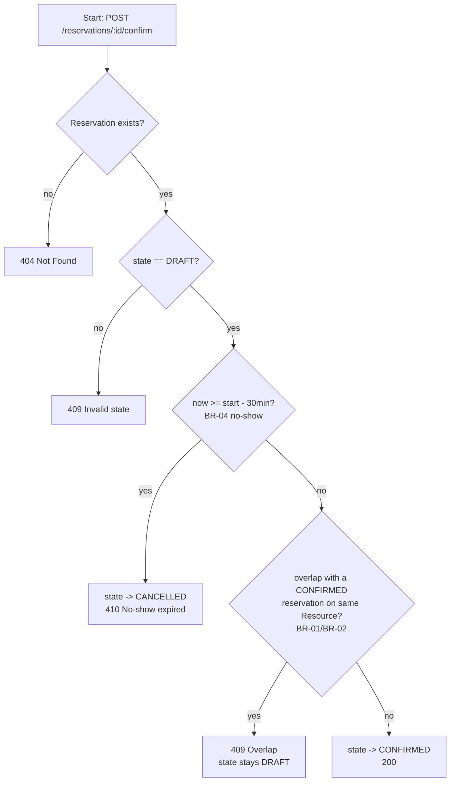
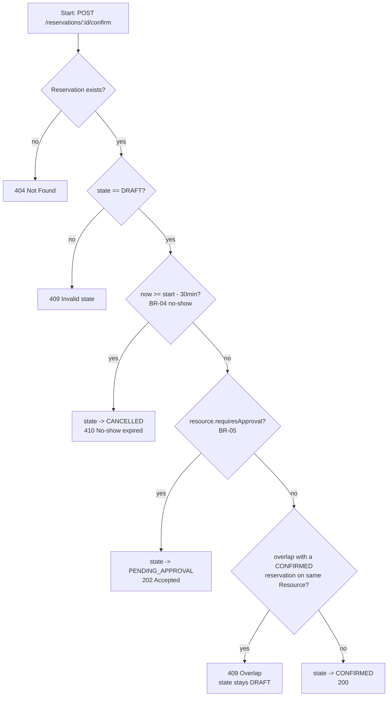
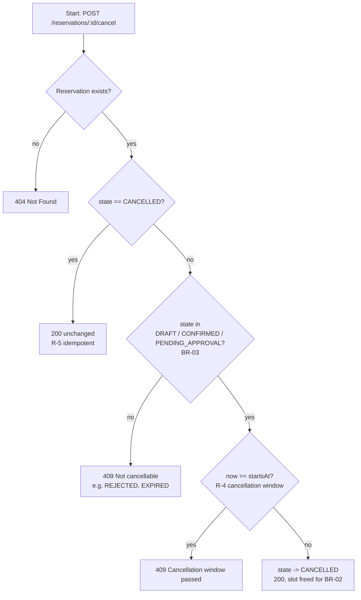
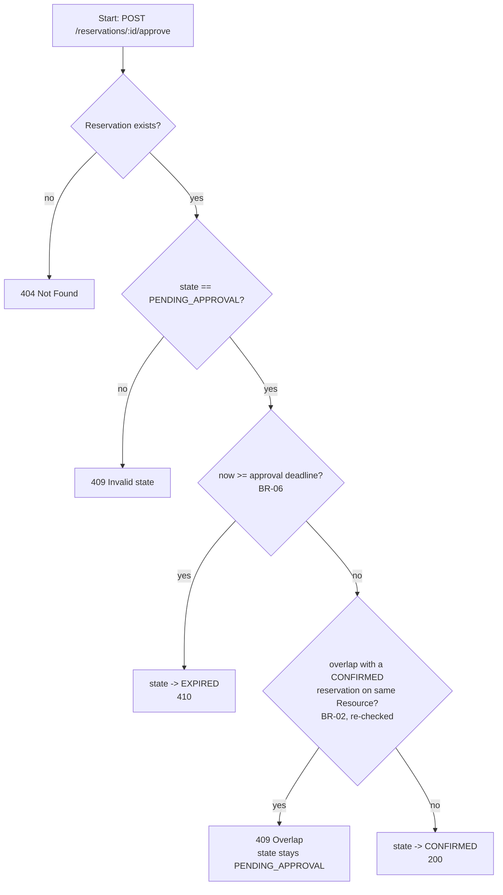

# 9c — Activity diagrams: Confirm a Cancel

Vlastník: **Osoba B** (`docs/c02-plan.md` úkol B7 pro v0.1; aktualizace pro v0.2 doplněna, aby
diagram nebyl neaktuální vůči `docs/specification.md`, viz konzistenční kontrola K-3).

## Confirm Reservation (OP-03) — v0.1

## Confirm Reservation (OP-03) — v0.2 update (BR-05 branch)

Rozdíl oproti v0.1: mezi krok D (no-show) a krok E (overlap) přibývá rozhodovací bod na
`Resource.requiresApproval`. Pro `requiresApproval = true` se overlap kontrola v Confirm
**přeskakuje** — přesouvá se do Approve (OP-05), viz níže.

## Cancel Reservation (OP-04) — v0.2 (guard totožný jako v0.1, jen širší množina zrušitelných stavů)

## Approve Reservation (OP-05) — v0.2

Všechny uzly změny stavu používají očekávaný výchozí stav při zápisu; uzly vedoucí
do CONFIRMED navíc atomicky ověřují BR-02. Ztracený souběh vrací 409 bez přepsání
aktuálního stavu, i když předchozí čtení prošlo. Dva Cancely mohou oba úspěšně
vrátit CANCELLED. Viz REQ-04 a `tests/services/concurrency.test.ts`.

Reject (druhá větev OP-05): existence → PENDING_APPROVAL → REJECTED (200);
neznámá rezervace → 404, jiný stav → 409. Deadline se u Reject nekontroluje (BR-06).
