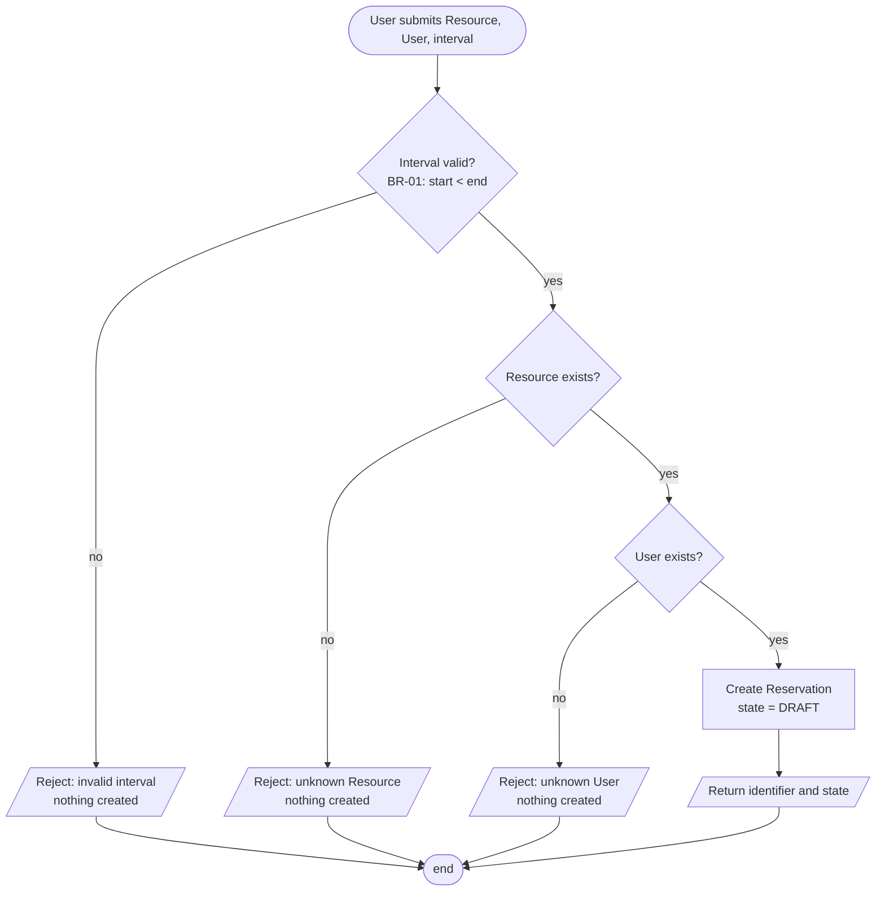
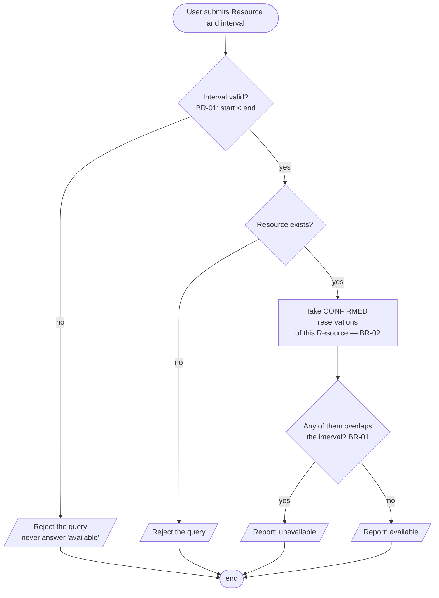

# Activity diagrams — OP-01 Create, OP-02 Check Availability (v0.1)

Owner: A. Each decision node corresponds to a stated precondition or failure outcome in
`../specification.md`; there is no step here that the text does not describe.

## OP-01 — Create Reservation

**Note the missing branch.** There is deliberately **no** overlap check in this flow (D-02).
A draft that conflicts with a confirmed reservation is created successfully and fails later, at
confirmation. If a reviewer expects a conflict branch here, the disagreement is about D-01, not
about this diagram.

## OP-02 — Check Availability

**Two things this flow asserts:**

1. Only CONFIRMED reservations are loaded — DRAFT ones are invisible here (D-01). This is the
   single place where the meaning of "blocking" is decided for the query path; OP-03 must decide
   it identically (check K-2).
2. An invalid question is rejected, never answered with `available`. Reporting a free table
   because the question could not be parsed is the worst possible failure mode of this operation:
   it is wrong in the direction that causes double bookings.
