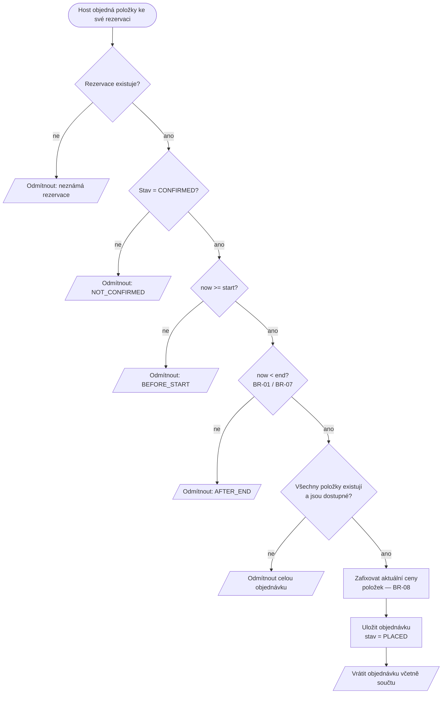
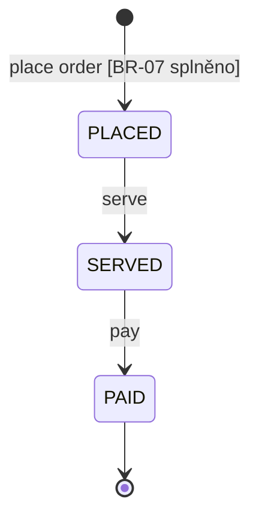

# Activity diagram — OP-06 Place Order (extension)

Owner: A. Odpovídá `../specification.md`, sekce OP-06, BR-07 a BR-08.

## Životní cyklus objednávky

Přeskočit krok nejde: zaplatit lze jen objednávku, která byla obsloužena (V-06.11). Účet
(*tab*) je součet objednávek rezervace rozdělený na zaplacené a nezaplacené — nezaplacená část
je „aktuální stav dluhu" z původního zadání projektu v C01.

**Proč se celá objednávka odmítá kvůli jedné neznámé položce:** částečně přijatá objednávka by
znamenala, že host neví, co dostane. Odmítnutí je hlasité a opravitelné, částečné přijetí tiché.
