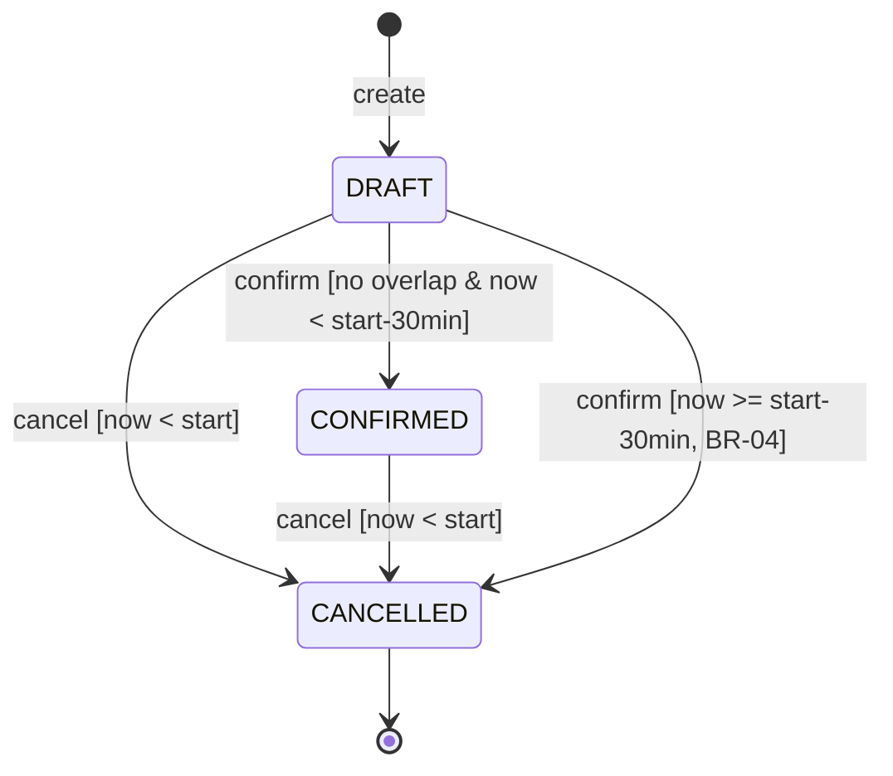
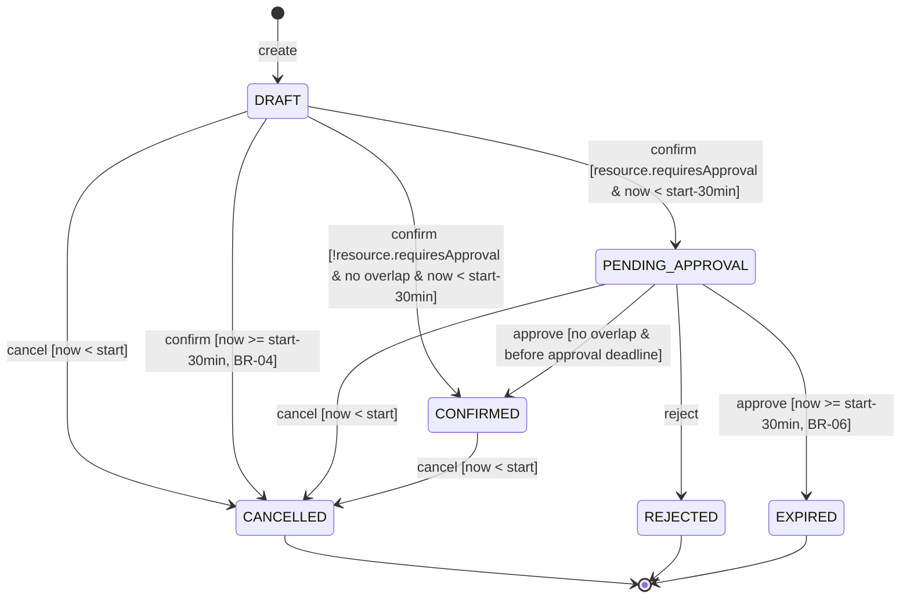

# 9b — Reservation state diagram

Vlastník: **Osoba B** (`docs/c02-plan.md` úkoly B6, B14). Guardy odpovídají textu v
`docs/specification.md` (OP-03, OP-04, OP-05, BR-03, BR-04, BR-05, BR-06) — viz konzistenční
kontrola K-3.

## v0.1 — baseline (Confirm / Cancel, bez schvalování)

Poznámka: `CANCELLED → CANCELLED` (idempotentní cancel, R-5) není v diagramu kreslen jako
samostatná šipka — je to vlastnost operace (cancel na CANCELLED je no-op, ne přechod), ne nová
hrana stavového diagramu.

## v0.2 — s workflow schvalování (Approve / Reject / Expire)

Přidává PENDING_APPROVAL, REJECTED, EXPIRED. Přímá cesta `DRAFT → CONFIRMED` z v0.1 zůstává pro
Resources s `requiresApproval = false` beze změny.

Guardy 1:1 s implementací (`src/domain/rules.ts`, `src/services/reservationService.ts`):

| Guard v diagramu | Odpovídající funkce/kontrola |
|---|---|
| `no overlap` | `findOverlappingConfirmed` + atomický guard v `ReservationRepository.transition` (BR-02, REQ-04) |
| `now < start-30min` (confirm), `before approval deadline` (approve) | `isExpiredDraft` / `isApprovalExpired` (BR-04/BR-06) |
| `now < start` (cancel) | `!isPastCancellationWindow` (BR-03/R-4) |
| `resource.requiresApproval` | `Resource.requiresApproval` (BR-05) |

Upřesnění v0.2 (22. 9. 2026): Reject nemá deadline guard; může ukončit i opožděnou
čekající žádost. Čtení a Availability nemění stav a nevyvolávají EXPIRED. Cancel na
CANCELLED je úspěšný no-op i po začátku. CONFIRMED nemá automatický přechod po konci
intervalu; COMPLETED není v rozsahu. Každý skutečný přechod ověřuje očekávaný stav
při zápisu; ztracený souběh vrací 409 bez přepsání vítěze. Diagram zobrazuje pouze
úspěšné přechody, nikoli chyby bez změny stavu.
