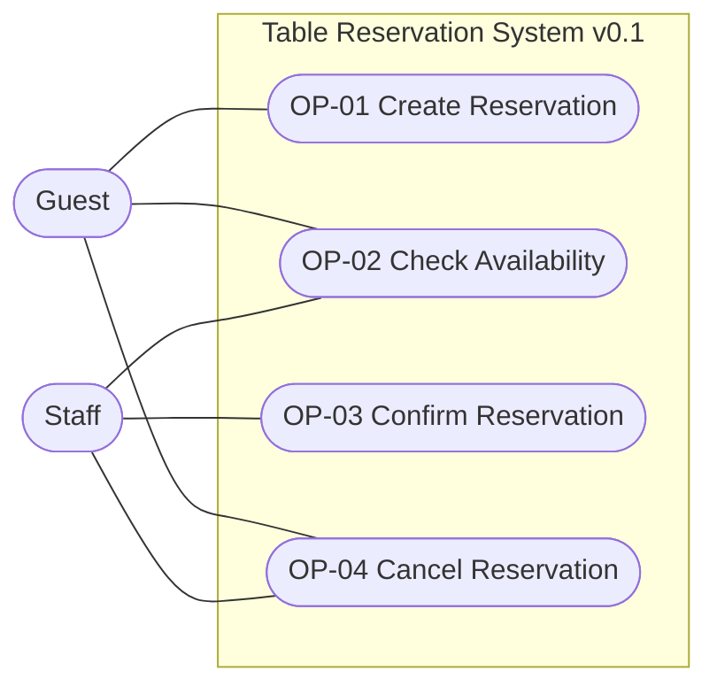
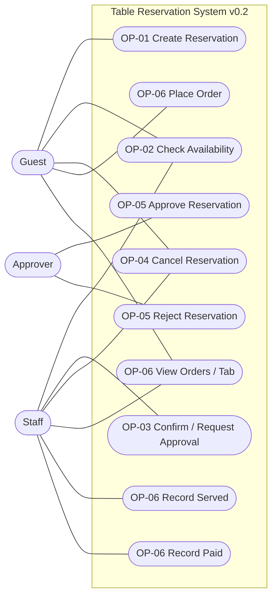

# Use-case view — reservation system

System boundary and actor goals, consistent with OP-01…06 in
[specification](../specification.md). Updated by Codex, 22 September 2026.
Actors describe intended use; authentication and ownership checks are outside
this candidate (R-7). Notification Service remains a future boundary, not an
implemented actor interaction.

## v0.1 — four core goals

## v0.2 — approval plus retained ordering extension

| Actor | Goals | Text |
|---|---|---|
| Guest | Create, availability, cancel, order, inspect tab | OP-01/02/04/06 |
| Staff | Availability, confirm/request approval, cancel, inspect tab, record service/payment | OP-02/03/04/06 |
| Approver | Accept or decline a pending request | OP-05 |

Approver can be the same person as Staff; it is a distinct goal role, not a new
authentication mechanism. Expiry is an outcome of Approve under BR-06, not a
separate actor goal or timer use case. Recording payment is not a payment-provider
integration. All four original goals remain in v0.2; no database/component nodes
or unsupported include/extend dependencies are introduced.
