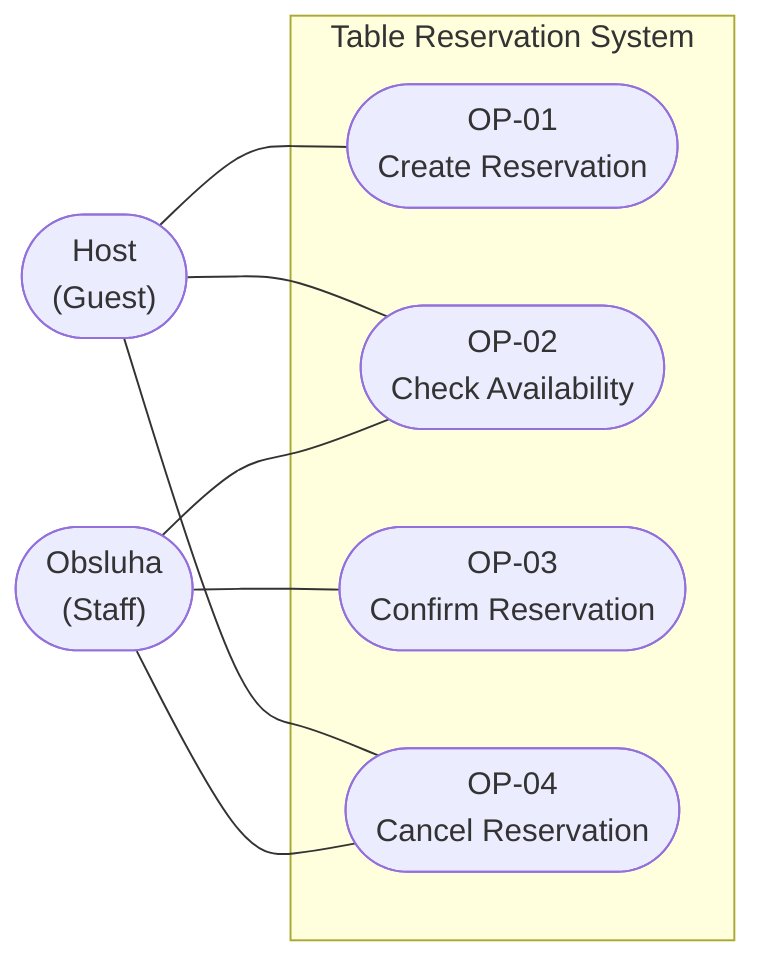

# Use case diagram — minimal system (v0.1)

Owner: A. Scope: the whole minimal reservation system, four goals, system boundary and actors.
Nothing else — no databases, no classes, no internal components.

## Actors

| Actor | Goals | Why it is here |
|---|---|---|
| **Host (Guest)** | Create a reservation, check availability, cancel own reservation | The person whose intent starts the whole process |
| **Obsluha (Staff)** | Check availability, confirm a reservation, cancel a reservation | The party that turns intent into a committed allocation of a table |

## Deliberate omissions

- **Notification Service is not drawn.** It is a defined system boundary from C01, but no
  behaviour in baseline v0.1 sends a notification. Drawing it would show a collaboration the
  specification does not describe. It gets drawn when an operation actually needs it.
- **No `include` / `extend` relations.** The four goals are independent; adding them would imply
  a decomposition that no requirement calls for.
- **Confirm is attributed to Staff only.** Under D-07 authorization is TBD, so this reflects the
  intended domain (the pub accepts the booking), not an enforced rule. If the team later decides
  guests may confirm their own reservations, this diagram and OP-03 change together.

## Consistency with the text (check K-5, owner B)

Every goal in the diagram has a specified operation, and every specified operation appears as a
goal. Once OP-03 and OP-04 are written, verify that the actor attributed to each goal matches the
preconditions stated there.
